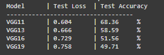

# 🐶🐱 Dog vs Cat Classification with VGG

Dự án này triển khai mô hình **VGG** để phân loại ảnh chó và mèo.  
Mô hình được huấn luyện bằng PyTorch, có thể chạy thử trực tiếp qua file `app.py`.

---

## 📂 Cấu trúc thư mục
```
│ .gitignore
│ app.py                # Flask/FastAPI app để chạy inference
│ index.html            # Giao diện web upload ảnh để predict
│ requirements.txt      # Các thư viện cần cài đặt
│ Train_VGG_for_Classify_Dog_Cat.ipynb # Notebook huấn luyện mô hình VGG11, VGG13, VGG 16, VGG19
│ VGG.py                # Định nghĩa kiến trúc VGG
```

## Backend 
Backend được deploy trên **Hugging Face Space**.  
Do giới hạn **1GB dung lượng lưu trữ** của Space, repo này chỉ demo với mô hình **VGG11** (model có accuracy cao nhất).  

Các mô hình khác (VGG13, VGG16, VGG19) đã được huấn luyện và lưu tại Google Drive:  
👉 [Link Drive](https://drive.google.com/drive/folders/140VgMYWKlfni-tnGeM6yHK0DvkHTp9Lp?usp=sharing)

## Kết quả huấn luyện:


## Chạy thử local

1. Clone repo:
2. Cài đặt dependencies:
```
pip install -r requirements.txt
```
3. Tải file model từ link drive. Đặt file vào thư mục gốc của repo (cùng cấp với app.py).

4. Chạy server:
```
python app.py
```
5. Mở **index.html** và chỉnh sửa biến:
````
const backendURL = "http://127.0.0.1:7860"
````
6. Thực thi lệnh để chạy frontend:
```
python -m http.server 8000
```
7. Truy cập ứng dụng tại:
````
http://127.0.0.1:8000/index.html
```